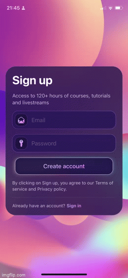

# SwiftUIAdvanced 👋

A to practice swift UI Advanced based on the course [Advanced Development in SwiftUI](https://designcode.io/swiftui-advanced-building-the-signup-card/)

<a href="#">
 
  
</a>  
  
     SwiftUIAdvanced
      
  
  
   
     
    <a href="https://github.com/brenfondeadora/SwiftUiAdvanced/issues/new">Report bug</a>
    ·
    <a href="https://github.com/brenfondeadora/SwiftUiAdvanced/issues/new">Request feature</a>

## 👤 Author

**Brenda Saavedra**

- WebPage: [brendasaavedra.com](http://brendasaavedra.com)
- Github: [@brenfondeadora](https://github.com/brenfondeadora/)
